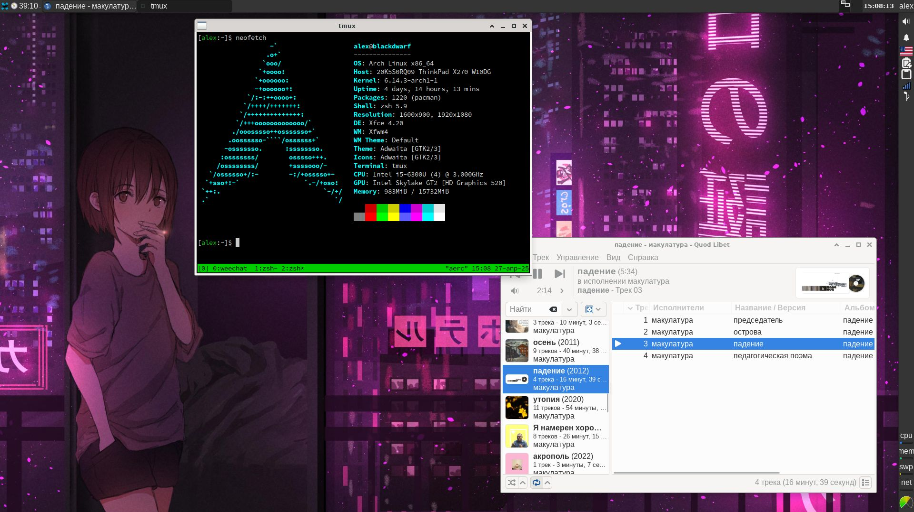

# Dotfiles



## Requirements

```
$ pacman -Sy xfce4 xfce4-clipman-plugin xfce4-datetime-plugin xfce4-pulseaudio-plugin xfce4-systemload-plugin xfce4-xkb-plugin zsh zsh-completions powerline-fonts quodlibet aerc python-html2text rofi neovim
```

